# Gatherly

## Project Overview

This repository contains the implementation of **Gatherly**, a web application for organising and
attending local events, inspired by platforms such as Meetup and Eventbrite. Users create events on
their own or within a community, sign up for events, and take part in the conversation around them.
Organisers approve registrations, keep a waiting list and record who actually turned up, which the
application uses to calculate a reliability score for each participant.

The project was developed as a final thesis at the Faculty of Technical Sciences, University of
Novi Sad.

### Applications
- **Server**: Java Spring Boot backend, REST API.
- **Web Client**: Angular frontend.

## Launch Guide

Below are the steps to get the project up and running on your local environment.

### Prerequisites
1. Java 21 (Eclipse Temurin or another JDK 21 distribution)
2. Maven 3.9 or newer
3. MySQL 8
4. Node.js 20.19 or newer (the project was developed on 24.18)
5. IntelliJ IDEA
6. Visual Studio Code
7. An SMTP account for outgoing mail (the project uses Brevo)

### Step 1: Clone the Repository
```bash
git clone https://github.com/flower0408/Gatherly
```

### Step 2: Import the Project in IntelliJ IDEA
Open IntelliJ IDEA and import the `eventhub-backend` module. Set the **Project SDK** and the
**Language level** to 21, and set the Maven runner JRE to 21 as well
(`Settings → Build, Execution, Deployment → Build Tools → Maven → Runner`).

### Step 3: Load Maven Dependencies
Ensure all necessary Maven dependencies are downloaded.

### Step 4: Set Up the Database
- Ensure MySQL is installed and running.
- Create a database named `eventhub`.
- Update `eventhub-backend/src/main/resources/application.properties` with your MySQL credentials.

The schema is created by Hibernate on every start (`spring.jpa.hibernate.ddl-auto=create-drop`) and
filled from `data.sql`, so the database is reset to a known state each time the server starts.

### Step 5: Set Up Outgoing Mail
Copy the template and fill in your own SMTP credentials:
```bash
cp eventhub-backend/application-local.properties.example eventhub-backend/application-local.properties
```
The file `application-local.properties` is not kept in the repository. If it is left empty the
application still runs, but no mail is sent and every attempt is written to the log instead.

### Step 6: Run the Application
Start the backend from IntelliJ IDEA, or from the terminal:
```bash
mvn spring-boot:run
```
The API is served at `http://localhost:8080`.

### Step 7: Start Angular Frontend
1. Open Visual Studio Code.
2. Navigate to the `angular-frontend` directory.
3. Start the Angular app with npm:
```bash
npm install
npm start
```

### Step 8: Access the Platform
- **Frontend:** Open a web browser and go to [http://localhost:4200/](http://localhost:4200/)

### Test Accounts
All accounts created by `data.sql` share the same password: **`gatherly demo 2026`**

| Username | Role |
|---|---|
| `pera` | system administrator |
| `ana`, `jovana`, `marko`, `tijana` … | regular users, organisers of several communities |

## Functionalities

- **User Registration:** Users register with a username, email and password. The account has to be
  confirmed through a link sent by email before the first sign-in.
- **Password Rules:** A new password must have at least 15 characters, must not appear on a list of
  common passwords, and must not contain the username or the email address. No rules about mixing
  upper case, digits or symbols are imposed.
- **Login and Logout:** Users sign in with a username and password. After five failed attempts the
  account is locked for fifteen minutes.
- **Browsing Events:** Anyone, signed in or not, can browse events, read comments and see how many
  places are taken.
- **Searching and Filtering:** Events can be searched by title, description or place, and filtered
  by category and by date range, with an option to hide events that have already happened.
- **Handling Events:** A signed-in user can create an event on their own or, as an organiser, inside
  one of their communities. The organiser can edit the event, replace its cover image or delete it.
- **Registrations and Waiting List:** Users sign up for an event and the organiser accepts or
  rejects each request. When an event is full new requests go to a waiting list, and as soon as a
  place is freed the first person on the list is promoted automatically and notified by email.
- **Overlapping Events:** When a user signs up for an event that overlaps one they already attend,
  the application warns them about it.
- **Attendance and Reliability:** After the event the organiser records who turned up and who did
  not. From that history the application calculates a reliability score, shown to organisers when
  they decide on a request.
- **Adding to Calendar:** Every event can be downloaded as an `.ics` file and opened in any calendar
  application.
- **Handling Communities:** Users create and administer communities. An organiser can hand the role
  to another member, and only an administrator can take it away from someone else.
- **Comments and Replies:** Users comment on events and reply to comments. Comments on an event that
  belongs to a community are open to its members.
- **User Reactions:** Users respond to events and comments with likes, dislikes and hearts.
- **Sorting Comments:** Comments can be sorted by publication date, likes or hearts.
- **Reporting:** Users report inappropriate events, comments or people. A report about content in a
  community is resolved by its organiser, everything else by the system administrator.
- **Blocking and Unblocking:** An organiser blocks a person from their own community, while the
  system administrator blocks from the whole platform. An administrator cannot be blocked, and an
  organiser cannot block another organiser of the same community.
- **Community Suspension:** The system administrator suspends a community and gives a reason.
- **Change Password:** Users change their password by entering the current one and a new one twice.
- **Change Profile Data:** Users set their display name, description and profile picture. The
  profile also shows their communities and the events they are hosting next.

## Non-functional Requirements

- User authentication using username and password.
- Authorization using the token mechanism.
- Access control enforced on the server for every request, not only in the user interface.
- Log messages about important events during application execution.

## Technologies Used
- Spring Boot 4.1 (Spring Framework 7, Spring Security 7)
- Java 21
- Hibernate 7, MySQL 8
- Angular 22, TypeScript 6
- Bootstrap 5.3 with the Bootswatch *Pulse* theme
- JSON Web Token (jjwt 0.13)
- JUnit 5, Mockito, Jasmine and Karma

## Application Architecture

The application consists of a web browser, a Spring container (Spring Boot) and a relational
database. The backend communicates with the frontend through a RESTful service. The frontend is a
single-page Angular application which sends a token with every request; the backend checks that
token on each request and decides, from the role and from the relationship between the user and the
record, whether the action is allowed.

## Data Model

The data model includes the entities:

- **User** represents a registered user of the application and stores the data used for
  authentication and authorization. A user can also be a system administrator.
- **Event** represents an event, described by a title, place, time span, capacity and category. Every
  event has an organiser, and it may belong to a community.
- **Community** represents a group of people who organise events together. It has organisers and
  members, and it can be suspended by an administrator.
- **EventRegistration** represents one person's registration for one event and carries its status:
  waiting for a decision, on the waiting list, going, not accepted, cancelled, attended or no-show.
- **Comment** represents a comment on an event, and it can be a reply to another comment.
- **Reaction** represents a reaction to an event or a comment.
- **Report** is created when content violates the rules, and it refers to an event, a comment or a
  user.
- **Image** represents an uploaded picture: a cover image of an event or a profile picture.
- **Banned** records that a person has been blocked, either from one community or from the whole
  platform.


## Images of project

### Login and Register
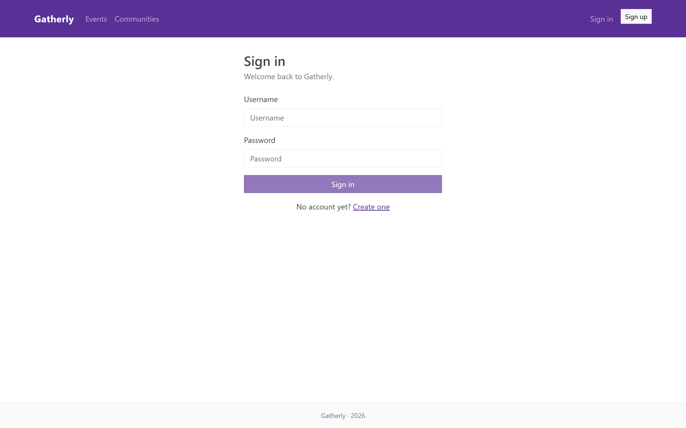
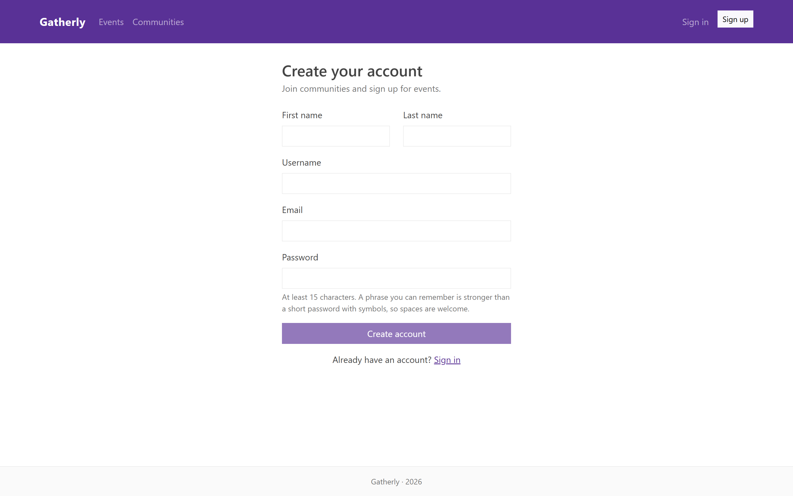

### Events
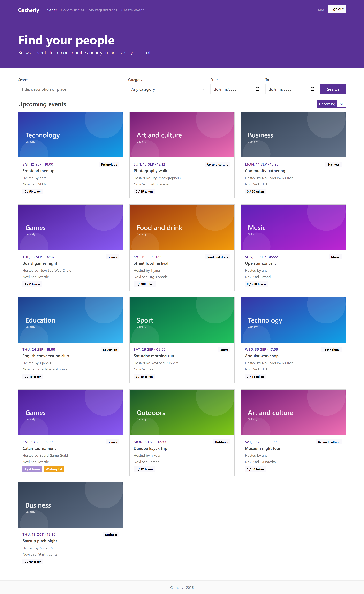
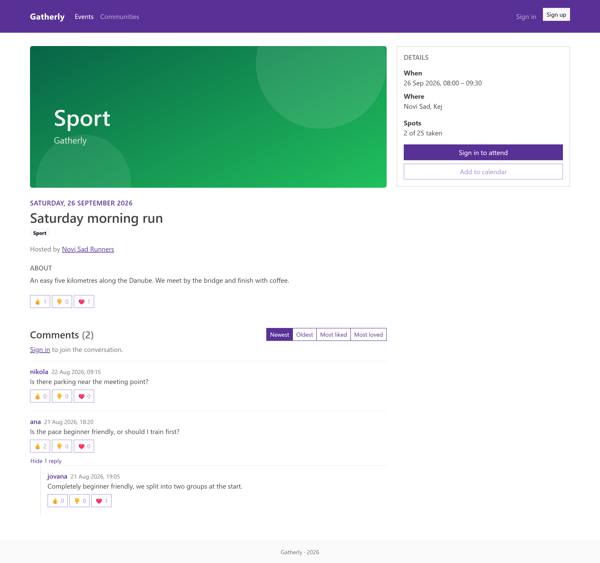
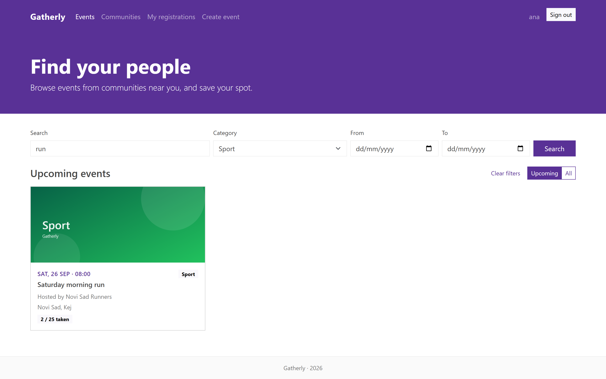
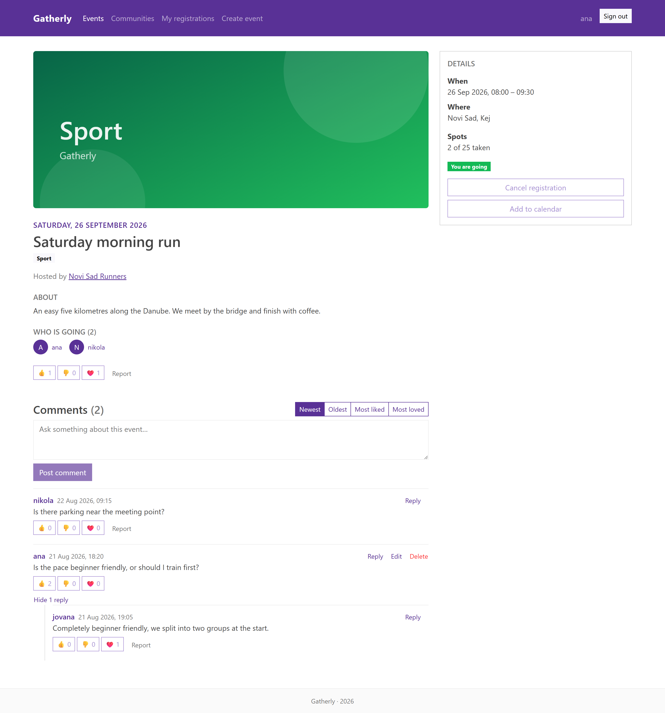

### Creating an Event
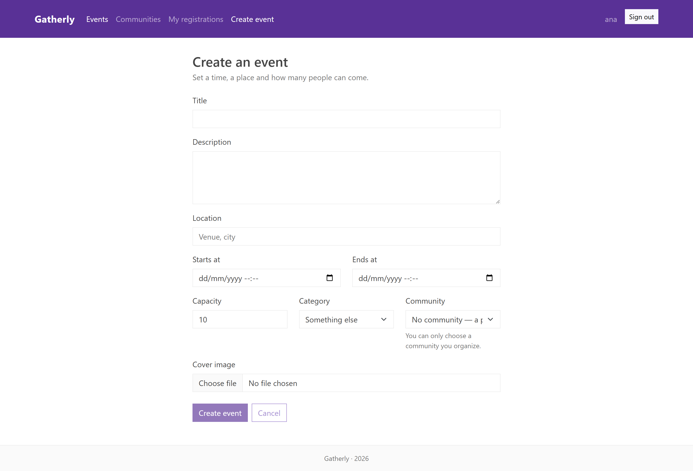

### Registrations
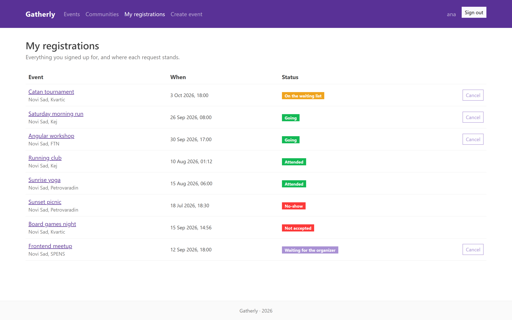
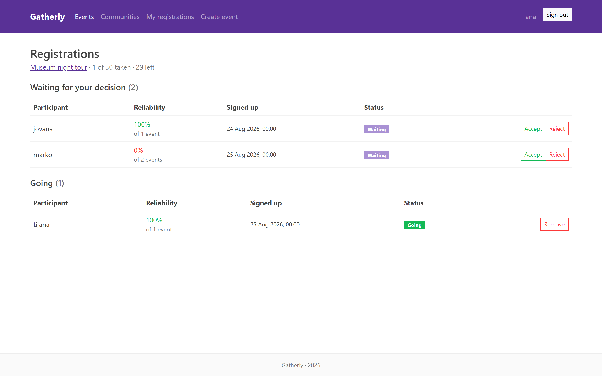

### Communities
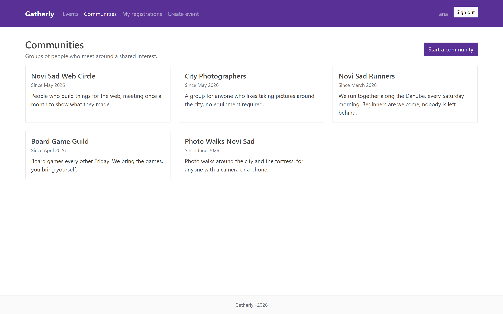
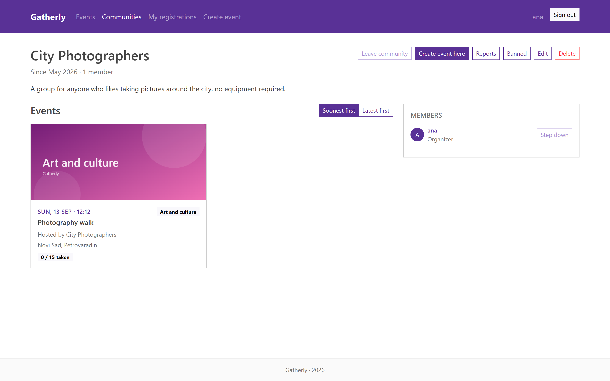
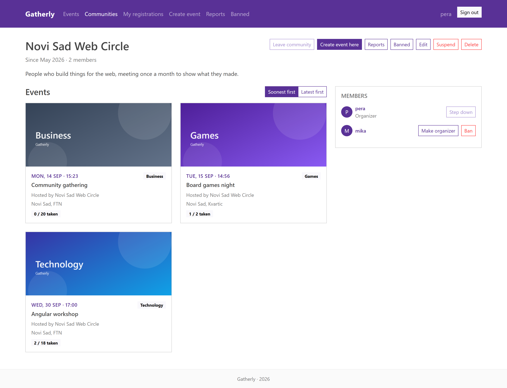

### Profile
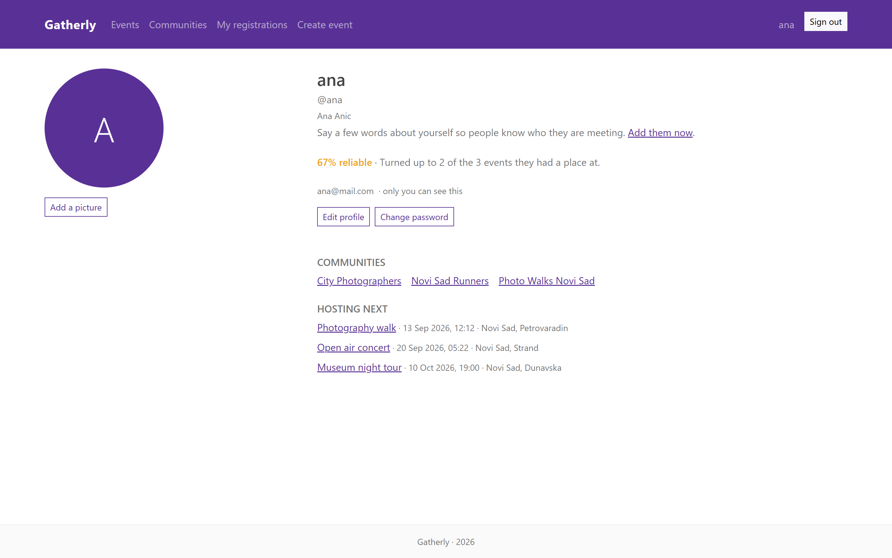

### Moderation
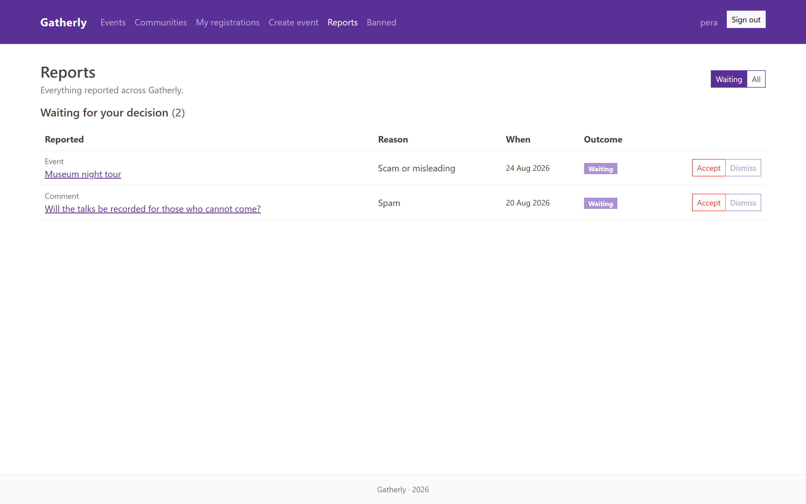
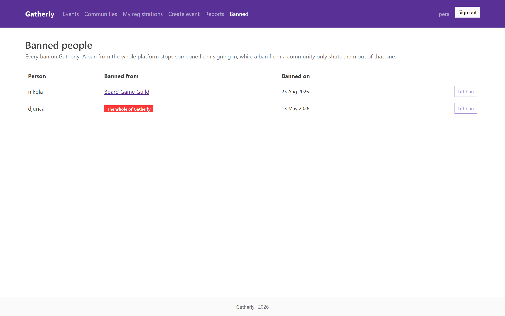

## Testing

The backend is covered by 31 tests and the frontend by 18.

```bash
cd eventhub-backend && mvn test
cd angular-frontend && npm test
```

The backend tests cover the password rules, the reliability score, promotion from the waiting list,
and searching and detecting overlapping events. The last group runs against the real database,
because that part relies on queries written in SQL. Note that `mvn test` drops the schema when it
finishes, so the server has to be started again afterwards to recreate the data.

The frontend tests cover the services that talk to the API, reading the token, and the rules that
decide how a registration is shown and when it can still be cancelled.

## Known Limitations

- Signing out removes the token from the browser, but the token itself stays valid until it expires
  one hour after it was issued. The server keeps no list of withdrawn tokens.
- Two people asking for the last free place at the very same moment are both accepted, because the
  free places are not counted under a lock.
- Deleting is soft: the row stays in the database and queries leave it out. A deleted account keeps
  its username and email address reserved, and the data is not physically erased.
- Uploaded images stay on disk after the record that used them is deleted.
- The signing key and the demo password are kept in the repository on purpose, so that the project
  can be started without any additional setup.
